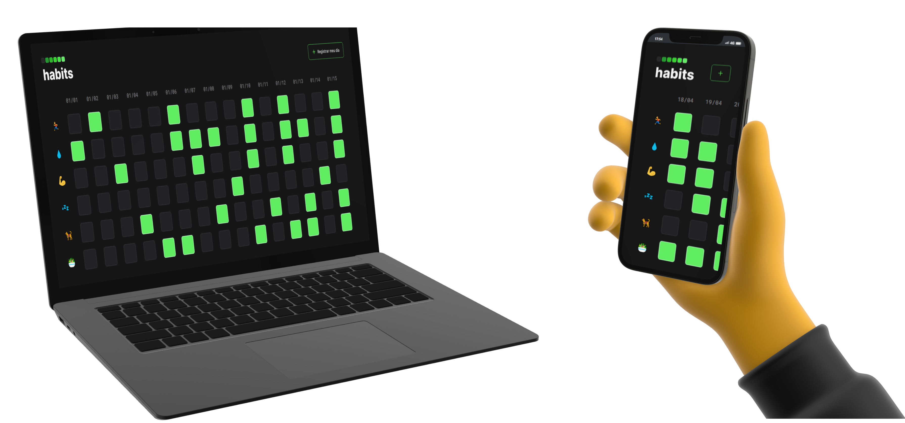
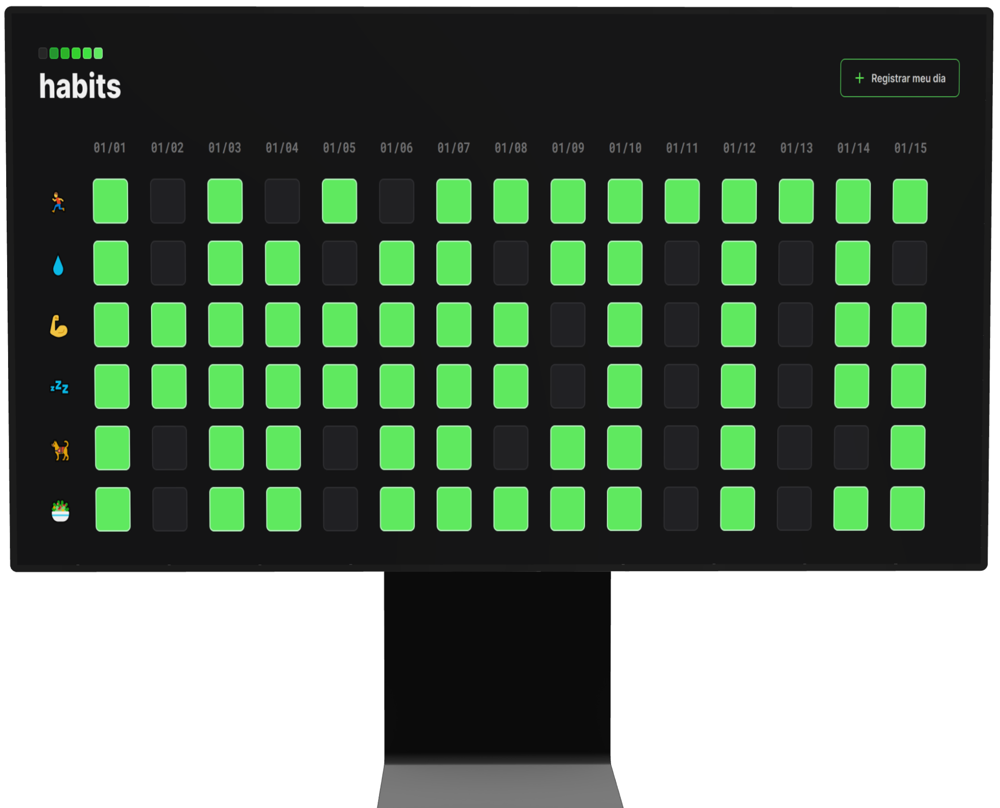

#  [Habits](https://carloscunha611.github.io/habits/)

    

> Este site é uma ferramenta que permite marcar a conclusão de rotinas diárias e criar uma linha do tempo com as tarefas concluídas.

## Funcionalidades e descrições

- Site otimizado para acesso em dispositivos móveis, tablets e desktops.
- Permite marcar e salvar seu progresso diário através do localStorage.
- Design limpo e simples, com destaque maior na linha do tempo das tarefas concluídas.

  

## ⚙ Tecnologias

- HTML5
- CSS3
- JavaScript
- Git / GitHub

## 🔗 Portfólio e links

  
  

